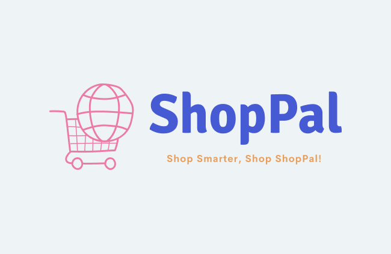

    
    <h1>ShopPal - Shop Smarter, Shop ShopPal!</h1>
    <h3>
        <a href="#" color="white">
        Live (WIP)
        </a>
         | 
        <a href="./assets/preview.mp4">
        Video (WIP)
        </a>
    </h3>

    An Online E-Commerce Platform For All Your Shopping Needs!

## 🧐 Introduction 

ShopPal is a full-stack e-commerce web application developed as a final project at [Holon Institute of Technology (HIT)](https://www.hit.ac.il/). It is built with modern web and backend technologies and offers a seamless fake shopping experience for clothing, electronics, home goods, and more.

## ⛏️ Technologies Used

[comment]: <> ()
[comment]: <> (target="\_blank" rel="noopener noreferrer")

<table>
    <thead>
        <tr>
            <th>Property</th>
            <th>Badges</th>
        </tr>
    </thead>
    <tbody>
        <tr>
            <td>🖥️ Front-End</td>
            <td>
                
                
                
                
                
                
                
                
            </td>
        </tr>
        <tr>
            <td>📡 Back-End</td>
            <td>
                
                
                
                
                
            </td>
        </tr>
        <tr>
            <td>🗄️ Database</td>
            <td>
                
                
            </td>
        </tr>
        <tr>
            <td>🚀 Runtime Environment</td>
            <td>
                
                
            </td>
        </tr>
        <tr>
            <td>☁️ Hosting</td>
            <td>
                Work In Progress...
                <!-- 
                 -->
            </td>
        </tr>
    </tbody>
</table>

## 🎈 Features 

- [x] **Login/Sign Up System**: Users can create an account or log in to an existing one. Authentication is handled using JWT tokens.
- [x] **Product Browsing**: Users can browse products by category, price, and rating. They can also search for specific items and view product details.
- [x] **Review/Rating System**: Users can leave reviews and ratings for products they have purchased and view reviews left by others.
- [x] **Cart System**: Users can add products to their cart, view their cart, and remove items from their cart.
- [x] **Checkout Process**: Users can simulate a purchase by entering fake payment information and completing the checkout process.
- [x] **Order History**: Registered users can view their order history and see the status of their past purchases.
- [x] **Account Management**: Registered users can update their account information, including their full name, user name, email, password, avatar image, delivery address, and fake payment information.
- [x] **Responsive Design**: ShopPal is designed to be responsive and accessible on all devices, including desktops, tablets, and smartphones.

## 🙏 Acknowledgements 

- [**Looka**](https://looka.com/) - For the logo design.
- [**Realtime Colors**](https://www.realtimecolors.com/) - For the color palette.
- [**IconScout**](https://iconscout.com/) - For the lottie animation and svg vector used in our home and authentication pages.
- [**React SVG Icons**](https://reactsvgicons.com/) - For most of the icons used in the project.

## 🎉 Contributors 

## 📄 License 

This project is licensed under the MIT License - see the [LICENSE](LICENSE) file for details.
